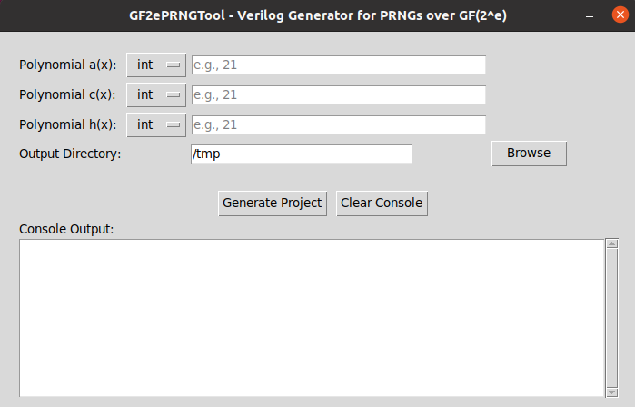
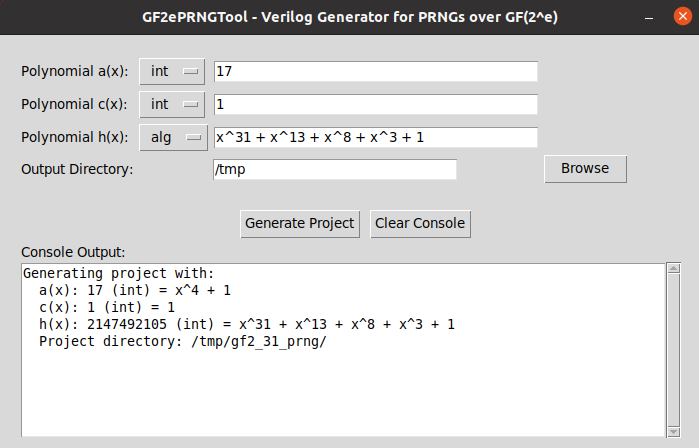

# GF2ePRNGTool

**GF2ePRNGTool** is a suite of Python scripts that automatically generate synthesizable Verilog modules and testbenches for Pseudorandom Number Generators (PRNGs) based on affine recurrence relations over the finite field GF($2^e$). It targets digital designers and researchers developing FPGA/ASIC architectures who need hardware-ready PRNG cores built from cryptographically relevant polynomial arithmetic.

---

## 📑 Table of Contents

- [✨ Features](#-features)
- [📁 Project Structure](#-project-structure)
- [🚀 Getting Started](#-getting-started)
  - [Requirements](#requirements)
  - [Installation](#installation)
- [💻 Command-Line Usage](#-command-line-usage)
- [🐁 GUI Usage](#-gui-usage)
- [🧩 Submodules](#-submodules)
- [📦 Output](#-output)
- [📚 Examples](#-examples)
- [🧪 Simulation](#-simulation)
- [📖 Citation](#-citation)
- [👨‍💻 Author](#-author)
- [📄 License](#-license)

---

## ✨ Features

- Generation of PRNGs based on:
  - Affine recurrence: $x_{n+1}(x) = a(x)·x_n(x) + c(x) \mod h(x)$ over GF(2)
  - Finite fields defined by an irreducible polynomial $h(x)$ (GF($2^e$))
- Automatic Verilog testbench generation with self-checking logic
- Modular generator scripts for:
  - Binary XOR trees
  - Polynomial multiplication, addition, and modular reduction over GF(2)
- GUI application to simplify parameter input and project generation
- ModelSim support with autogenerated simulation scripts

---

## 📁 Project Structure

```
GF2ePRNGTool/
│
├── code/                # Python scripts to generate Verilog code and testbenches
│   ├── gf2e_prng_tool_app.py              # GUI frontend
│   ├── gf2e_prng_tool.py                  # Main PRNG generator
│   ├── gf2_poly_affine_mod_generator.py   # a(x)p(x) + c(x) mod h(x)
│   ├── gf2_poly_affine_generator.py       # a(x)p(x) + c(x)
│   ├── gf2_poly_mod_generator.py          # y(x) mod h(x)
│   ├── gf2_poly_utils.py                  # Utility Functions
│   └── xor_tree_generator.py              # Binary XOR reduction tree
├── modelsim/           # Base simulation files
│
├── examples/           # Example outputs from generated PRNG projects
|
├── LICENSE             # License file
│
└── README.md           # Project documentation
```

---

## 🚀 Getting Started

### Requirements

- Python 3.6+
- Optional: [ModelSim/QuestaSim](https://www.intel.com/content/www/us/en/software-kit/750368/modelsim-intel-fpgas-standard-edition-software-version-18-1.html), for simulation and verification

### Installation

Clone the repository:

```bash
git clone https://github.com/davimoreno/gf2e_prng_tool
cd gf2e_prng_tool/code
```

Install any missing dependencies:

```bash
pip install -r requirements.txt
```

---

## 💻 Command-Line Usage

Generate a PRNG module from recurrence relation in GF($2^e$):

```bash
python3 gf2e_prng_tool.py <a> <c> <h> --dir <output_dir>
```

**Example:**

```bash
python3 gf2e_prng_tool.py 23 5 285 --dir ./output
```

This will create a full PRNG project for GF($2^8$), using:

- $a(x) = x^4 + x^2 + x + 1$
- $c(x) = x^2 + 1$
- $h(x) = x^8 + x^4 + x^3 + x^2 + 1$ (an irreducible polynomial of degree 8)

---

## 🐁 GUI Usage

You can also use the graphical interface:

```bash
python3 gf2e_prng_tool_app.py
```

This opens the following GUI:



Features:
- Accepts polynomial inputs in decimal, binary, hexadecimal, or algebraic format
- Browse to select output directory
- Generates full project structure with simulation files and testbenches

An example of using the GUI to generate a PRNG is shown bellow.



---

## 🧩 Submodules

All logic is built modularly using these generators:

| Script                            | Functionality                             |
|-----------------------------------|----------------------------------------------|
| `xor_tree_generator.py`           | Generates combinational XOR tree modules     |
| `gf2_poly_affine_generator.py`    | Generates a(x)p(x) + c(x) over GF(2) modules |
| `gf2_poly_mod_generator.py`       | Generates y(x) mod h(x) over GF(2) modules   |
| `gf2_poly_affine_mod_generator.py`| Generates (a(x)p(x)+c(x)) mod h(x) modules   |
| `gf2e_prng_tool.py`               | Top-level PRNG generator over GF($2^e$)      |

Each script supports `--help` for argument details.

---

## 📦 Output

Each PRNG project contains:

```
gf2_<e>_prng/
├── rtl/
│   ├── src/       # Verilog modules
│   └── tb/        # Testbenches
├── modelsim/      # Simulation scripts
├── LICENSE        # License file
└── README.md      # Project details
```

Modules are purely combinational (except the top-level PRNG which is sequential).

---

## 📚 Examples

See the `examples/` directory for some real PRNG configurations.

---

## 🧪 Simulation

You must have ModelSim installed and accessible via your system PATH.     

If `vsim` is not in the PATH, you can manually set the VSIM variable inside `modelsim/run_tb.sh`.

To run a ModelSim simulation:

```bash
cd examples/gf2_8_prng/modelsim
chmod +x run_tb.sh
./run_tb.sh tb_gf2_8_prng
```

To run multiple testbenches use

```bash
./run_tb.sh tb_example1 tb_example2 ...
```

Simulation will compile and run the Verilog testbench, checking correctness against Python-generated results.

---

## 📖 Citation

This software is part of the research contribution presented in the following paper:

> **[Paper Title]**  
> [Authors and Co-authors if any]  
> Presented at [Conference/Journal Name], [Year].

If you use this software in your research, please cite the paper using the following BibTeX:

```bibtex
@article{your_citation_key,
  author  = {Author and Co-authors},
  title   = {Paper Title},
  journal = {Proceedings of the XYZ Conference},
  year    = {2025},
  url     = {https://doi.org/xx.xxxx/xxxxxx}
}
```

---

## 👨‍💻 Author

**Davi Carvalho Moreno de Almeida** (*goes by Davi Moreno*)   
Alumni, PPGEE, Universidade Federal de Pernambuco (UFPE)

---

## 📄 License

This project is licensed under the MIT License. See `LICENSE` file for details.

---
